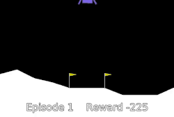
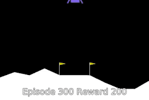
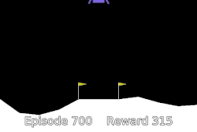

# Deep Deterministic Policy Gradient (DDPG) algorithm on OpenAI's LunarLander

## Summary
&nbsp;&nbsp;&nbsp;&nbsp;The goal of this application is to implement **DDPG algorithm**[[paper]](https://arxiv.org/pdf/1509.02971.pdf) on [Open AI LunarLanderContinuous enviroment](https://gym.openai.com/envs/LunarLanderContinuous-v2/).
  
 



*DDPG: Episode 1 vs Episode 300 vs Episode 700*

## Environment
&nbsp;&nbsp;&nbsp;&nbsp;[LunarLanderContinuous](https://gym.openai.com/envs/LunarLanderContinuous-v2/) is [OpenAI Box2D enviroment](https://gym.openai.com/envs/#box2d) which corresponds to the rocket trajectory optimization which is a classic topic in Optimal Control. LunarLander enviroment contains the rocket and terrain with landing pad which is generated randomly. The lander has three engines: left, right and bottom. Goal is to, using these engines, land somewhere on landing pad with using as less fuel as possible. Landing pad is always at coordinates (0,0). Coordinates are the first two numbers in state vector. Landing outside landing pad is possible. Fuel is infinite, so an agent can learn to fly and then land on its first attempt.


*LunarLander Enviroment [[Image source]](https://shiva-verma.medium.com/solving-lunar-lander-openaigym-reinforcement-learning-785675066197)*

&nbsp;&nbsp;&nbsp;&nbsp;State consists of the horizontal coordinate, the vertical coordinate, the horizontal speed, the vertical speed, the angle, the angular speed, 1 if first leg has contact, else 0, 1 if second leg has contact, else 0

&nbsp;&nbsp;&nbsp;&nbsp;Reward for moving from the top of the screen to the landing pad and zero speed is about 100..140 points. If the lander moves away from the landing pad it loses reward. The episode finishes if the lander crashes or comes to rest, receiving an additional -100 or +100 points. Each leg with ground contact is +10 points. Firing the main engine is -0.3 points each frame. Firing the side engine is -0.03 points each frame. Solved is 200 points.

&nbsp;&nbsp;&nbsp;&nbsp;Action is two real values vector from -1 to +1. First controls main engine, -1..0 off, 0..+1 throttle from 50% to 100% power. Engine can't work with less than 50% power. Second value -1.0..-0.5 fire left engine, +0.5..+1.0 fire right engine, -0.5..0.5 off.

&nbsp;&nbsp;&nbsp;&nbsp;The episode ends when the lander **lands on the terrain** or **crashes**. Goal is reached when algorithm achieves ***mean score of 200 or higher on last 100 episodes (games)***.

## Deep Deterministic Policy Gradient
&nbsp;&nbsp;&nbsp;&nbsp;Deep Deterministic Policy Gradient represents mixture of [DQN](https://arxiv.org/pdf/1312.5602.pdf) and [Actor-Critic algorithms](https://proceedings.neurips.cc/paper/1999/file/6449f44a102fde848669bdd9eb6b76fa-Paper.pdf). Since DQN doesn't work with [stochastic policy](https://ai.stackexchange.com/questions/12274/what-is-the-difference-between-a-stochastic-and-a-deterministic-policy), it couldn't be applied to the enviroments with continuous actions. Therefore DDPG was introduced, with hybrid deterministic policy. Instead of having stochastic policy which generates probability distribution from which we sample actions, we will create [deterministic policy](https://ai.stackexchange.com/questions/12274/what-is-the-difference-between-a-stochastic-and-a-deterministic-policy). 

&nbsp;&nbsp;&nbsp;&nbsp;To ensure our deterministic policy, which will output action based on state, is enough exploratory, we will add random function noise to action we got from policy. Even though the DDPG paper uses an [Ornstein-Uhlenbeck process](https://en.wikipedia.org/wiki/Ornstein%E2%80%93Uhlenbeck_process) for generating noise, later papers proved that using [Gaussian noise](https://en.wikipedia.org/wiki/Gaussian_noise) is just as effective and it will be used here to generate noise.

&nbsp;&nbsp;&nbsp;&nbsp; There are total of 4 neural networks in DDPG. DQN uses two NNs to create moving (NN which we update each step) and target (NN which is slowly following moving NN) neural network. Actor-Critic algoritms also have two NNs - Actor(policy NN which outputs actions from given state) and Critic(value function NN which gives estimated value of given state). Therefore DDPG, uses 4 NNs, moving and target for both Actor and Critic, where both target NNs follow moving NNs using [polyak averaging](https://en.wikipedia.org/wiki/Stochastic_approximation#Subsequent_developments_and_Polyak%E2%80%93Ruppert_averaging).


*DDPG algorithm*

## Improving DDPG
* To improve exploration, for first 10,000 steps we will take random actions [[Source]](https://spinningup.openai.com/en/latest/algorithms/ddpg.html#exploration-vs-exploitation)
* Changing [epsilon (from Adam optimizer)](https://pytorch.org/docs/stable/generated/torch.optim.Adam.html#torch.optim.Adam) to hyperparameter instead of default value of 1e-8
* Decaying learning rate to zero based on number of steps done
* Decaying standard deviation (therefore random noise as well) to zero based on number of steps done [[Source]](https://github.com/openai/spinningup/blob/master/docs/algorithms/ddpg.rst#pseudocode)

## Testing
&nbsp;&nbsp;&nbsp;&nbsp; To get accurate results, algorithm has additional class (test process) whose job is to occasionally test 100 episodes and calculate mean reward of last 100 episodes. By the rules, if test process gets 200 or higher mean score over last 100 games, goal is reached and we should terminate. If goal isn't reached, training process continues. Testing is done every 50,000 steps or when mean of last 10 returns is 200 or more.

## Results
&nbsp;&nbsp;&nbsp;&nbsp;One of the results can be seen on graph below, where X axis represents number of episodes in algorithm and Y axis represents episode reward, mean training return and mean test return (return = mean episode reward over last 100 episodes). Keep in mind that for goal to be reached mean test return has to reach 200.


-  `Episode reward`
-  `Mean training return`
-  `Mean test return`

* During multiple runs, **mean test return is over 200**, therefore we can conclude that **goal is reached!**

&nbsp;&nbsp;&nbsp;&nbsp;Additional statistics

* **Fastest run reached the goal after 71,435 enviroment steps (194 episodes)**.
* **Highest reward in a single episode achieved is 315.3**.

## Rest of the data and TensorBoard
&nbsp;&nbsp;&nbsp;&nbsp; If you wish to use trained models, there are saved NN models in [/models](/models). You will have to modify `load.py` PATH parameters and run the script to see results of training.

&nbsp;&nbsp;&nbsp;&nbsp; **If you dont want to bother with running the script, you can head over to the [YouTube](https://www.youtube.com/watch?v=RO-LN5Uqu3g) or see best recordings in [/recordings](/recordings).**

&nbsp;&nbsp;&nbsp;&nbsp;Rest of the training data can be found at [/content/runs](/content/runs). If you wish to see it and compare it with the rest, I recommend using TensorBoard. After installation simply change the directory where the data is stored, use the following command
  
```python
LOG_DIR = "full\path\to\data"
tensorboard --logdir=LOG_DIR --host=127.0.0.1
```
and open http://localhost:6006 in your browser.
For information about installation and further questions visit [TensorBoard github](https://github.com/tensorflow/tensorboard/blob/master/README.md)
  


